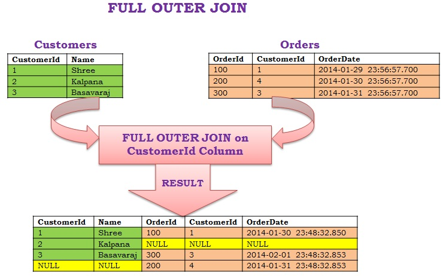

# Aufgabe 2
## 1
Beim inneren Join gehen alle Tupel verloren, für die kein Match gefunden werden kann. (egal ob diese aus der linken oder rechten Tabelle stammen)
Beim äußeren Join hingehen bleiben diese erhalten. Kann also für ein Tupel aus Tabelle A kein Match in Tabelle B gefunden werden, so bleibt das Tupel aus Tabelle A erhalten und erhält für die Attribute aus B einfach keinen Wert. Das Gleiche gilt analog dafür, wenn das Tupel aus B kommt und kein Match in A enthält.


Beispiel mit Ergebnissen:

 \
[^1]

[^1]: https://sqlhints.com/wp-content/uploads/2014/01/FULL-OUTER-JOIN.jpg

## 2
## TODO
```SQL
SELECT * FROM t1
LEFT JOIN t2 ON t1.id = t2.id
UNION
SELECT * FROM t1
RIGHT JOIN t2 ON t1.id = t2.id
```

Ein Full Outer Join ist die Kombination aus einem Left Outer Join und einem Right Outer Join und genau die beiden werden hier dann auch kombiniert. Bei UNION fallen die Zeilen raus, die durch das Zusammensetzen doppelt sein würden, was hier auch genau der gewollte Effekt ist.

## 3
```SQL
SELECT *
FROM (SELECT Student.StuNo, Student.Name, Student.Semester, attend.CouNo FROM Student
LEFT JOIN attend ON Student.StuNo=attend.StuNo) as t
LEFT JOIN Course ON t.CouNo=Course.CouNo

UNION

SELECT *
FROM (SELECT Student.StuNo, Student.Name, Student.Semester, attend.CouNo FROM Student
LEFT JOIN attend ON Student.StuNo=attend.StuNo) as t
RIGHT JOIN Course ON t.CouNo=Course.CouNo;
```