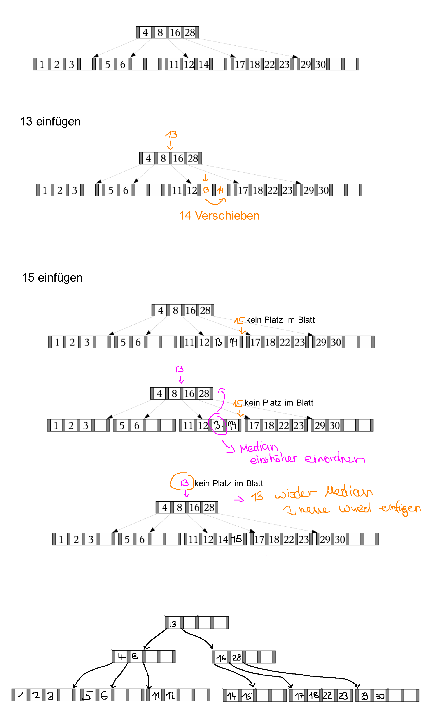

# Aufgabe 3
## 1
### B-Baum
- Lässt sich gut zur Suche verwenden
- Balanciert
- Lässt sich gut auf Speicher-Seiten abbilden
- Vorteile gegenüber B+-Baum:
  - Existiert beispielsweise eine Menge von Tupeln, welche häufig abgefragt wird, so lassen diese sich in einem Knoten mit geringerer Tiefe abspeichern und werden somit schneller gefunden (Werden z. B. IDs zwischen 10 und 20 häufig abgefragt, so lassen sich diese dann gut weiter oben im Baum speicher, während z. B. IDs größer 10000 tiefer im Baum liegen)
  - Es wird kein zusätzlicher Speicher für nicht existierende Referenzen verbraucht

### B+-Baum
- Vorteile gegenüber B-Baum
  - Inhalte werden auf die Blätter verlagert, dadurch müssen die Referenzschlüssel keinen realen Schlüssel entsprechen, was das Löschen vereinfacht
  - Da nun nur noch die Referenzen in den Knoten gespeichert werden, lassen sich innerhalb einer Seite mehr Referenzen abspeichern, was eine größere Verzweigung, damit eine geringere Tiefe und somit auch eine schnellere Suche ermöglicht

### R-Baum
- Lässt sich wie Boxen vorstellen, welche eine räumliche Indizierung vornehmen
- Bereiche lassen sich gut abbilden
- Vorteil gegenüber den anderen Strukturen: Stehen beispielsweise zwei Attribute in Relation und wird von diesen häufig in Kombination ein Intervall abgefragt, so ist diese Struktur dafür sehr nützlich (Will man z. B. Alter zwischen 40 und 60 wieso Gehalt zwischen 50000 und 80000 abfragen, geht dies gut)
- Nachteile gegenüber den anderen Strukturen:
  - Einfügen und Löschen kann ggf. recht kompliziert werden
  - Möchte man nur ein Attribut abfragen, so lohnt sich die Struktur nicht, da immer mehrere Attribute in einer Relation stehen

## 2
a)  R-Bäume sind gut um bestimmte Intervalle bzw. Bereiche zu speichern und zu suchen. Da hier aber nur nach einem Attribut gesucht wird, lohnt sich der R-Baum nicht. Eine der anderen beiden Baumarten ist dafür hier besser geeignet.

b)  Da hier nach einem genauen Wert gefragt ist, eignet sich hier ein Hash-Trie. Dieser genaue Wert lässt sich dabei kodieren und mit der Kodierung lässt sich der Trie durchlaufen um den Eintrag zu finden, ohne dass vorher ein Baum mit vielen Vergleichen durchlaufen werden muss

## 3
<!--  -->

  
