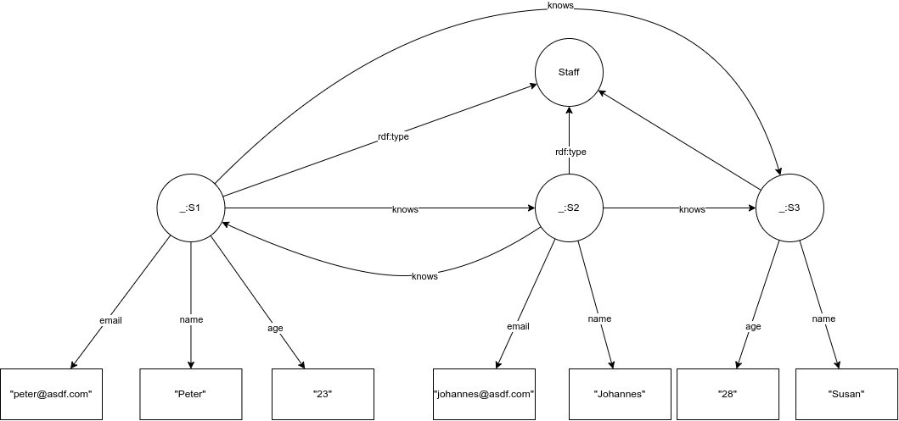

# Aufgabe 3
## 1
  

## 2

```XML
<rdf:RDF
      xmlns:rdf="http://www.w3.org/1999/02/22-rdf-syntax-ns#"
      xmlns:_="http://example.org/"
>
    <_:S1>
        <rdf:type rdf:resource="Staff"/>
        <_:name>Peter</_:name>
        <_:age>23</_:age>
        <_:email>peter@asdf.com</_:email>
        <_:knows rdf:resource="_:S2"/>
        <_:knows rdf:resource="_:S3"/>
    </_:S1>
    <_:S2>
        <rdf:type rdf:resource="Staff"/>
        <_:name>Johannes</_:name>
        <_:email>Johannes@asdf.com</_:email>
        <_:knows rdf:resource="_:S1"/>
        <_:knows rdf:resource="_:S3"/>
    </_:S2>
    <_:S3>
        <rdf:type rdf:resource="Staff"/>
        <_:name>Susan</_:name>
        <_:age>28</_:age>
    </:_S3>
</rdf:RDF>
```

## 3
```turtle
@prefix rdf: <http://www.w3.org/1999/02/22-rdf-syntax-ns#>
@prefix _: <http://example.org/>
_:S1
    rdf:type Staff;
    _:name "Peter";
    _:age "23";
    _:email "peter@asdf.com".
_:S2
    rdf:type Staff;
    _:name "Johannes";
    _:email "johannes@asdf.com".
_:S3
    rdf:type Staff;
    _:name "Susan";
    _:age "28".
_:S1 _:knows _:S2.
_:S1 _:knows _:S3.
_:S2 _:knows _:S1.
_:S2 _:knows _:S3.
```