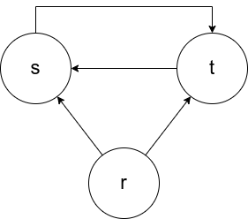

# Aufgabe 3
## 1
  


## 2
Da der Abhängigkeitsgraph einen Kreis enthält, ist das Programm rekursiv

## 3
```
for s(X, Y) :- r(X, Y) ∪ s(X, Z) ∩ r(Z, Y)
    - Start: s = {}
    - repeat
      - s' = s
      - s = r(X, Y)
      - s = s ∪ s'(X, Z) ∩ r(Z, Y)
    - until s' = s
    - output s
```

```
for t(X, Y) :- r(X, Z) ∩ r(Z, Y) ∪ t(X, Z) ∩ r(X, Z)
    - Start: s = {}
    - repeat
      - t' = t
      - t = r(X, Z) ∩ r(Z, Y)
      - t = t ∪ t'(X, Z) ∩ r(X, Z)
    - until t' = t
    - output t
```

## 4
s ist dann eine 'Vorgängerrelation'. Also gibt s die Kurse Y an, welche auf X aufbauen.
Mit t wird dann überprüft, ob X eine Voraussetzung einer Voraussetzung von Y ist.
Zusammen sind diese beiden dann ein rekursives Programm, welche es ermöglicht jeden Vorgänger eines Moduls Y oder jeden Nachfolger eines Moduls X zu finden.