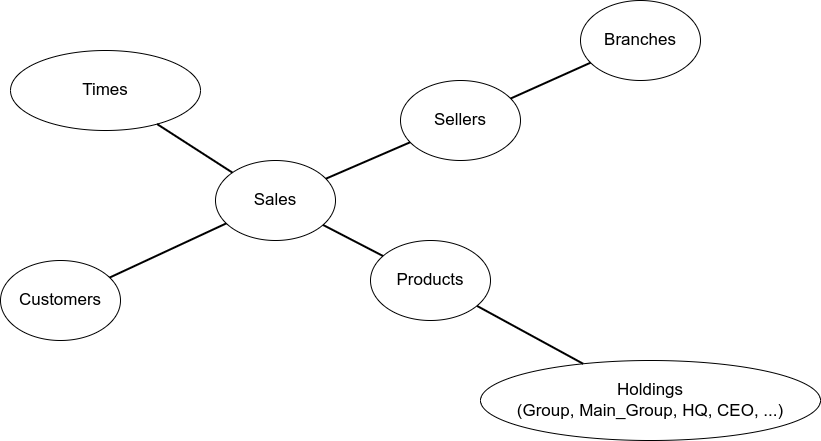

# Aufgabe 2
## 1
Bei Datawarehouses werden eine große Menge an Daten verarbeitet. Daher möchte man nicht, dass dort z. B. Dopplungen, Imperfektionen ("imperfection"), Unsicherheiten ("uncertainty") oder Unschärfen ("fuzziness" oder "vagueness") auftreten. Daher ist es wichtig, dass die Daten zuvor bereinigt werden, damit diese ungewollten Eigenschaften nicht auftreten.
Damit die Anfragen dort dann effizienter stattfinden können, werden die Daten zuerst aggregiert.

## 2
Star-Schema:  
- Vorteile:
  - Dimension tables müssen nicht normalisiert werden, was das Erstellen/Einfügen beschleunigt
  - Geringe Anzahl von Joins
  - Simpler Aufbau
- Nachteile:
  - Die Dimensionstabelle können recht groß werden, wodurch bei den Joins noch größere Tabellen entstehen und somit die Abfragezeit erhöht wird
  - Schwer integrierbar bei manchen Modellen

Snowflake-Schema:  
- Vorteile:
  - Modularer
  - Keine Dopplungen -> ggf. weniger Speicherverbrauch
  - Kleinere Tabellen, welche bei Joins entstehen

- Nachteile:
  - Mehr Joins -> ggf. langsamere Abfragezeit
  - Kompliziertere Struktur/Aufbau

## 3
  
