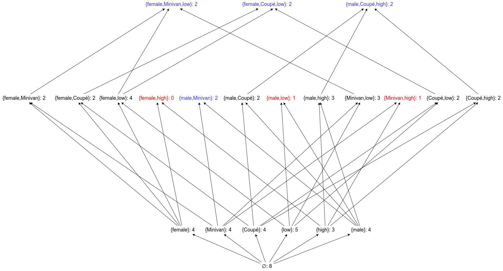

# Aufgabe 2
## 1
Annahme: Min = 2
  
Vorgehen: Am kombiniert alle Itemsets untereinander. Entsteht dabei ein Itemset, welches nun schon nicht mehr Min=2 erfüllt (siehe dir rot markierten), so können keine Itemsets mehr entstehen, welche diese Itemsets als Subsets haben und werden somit auch nicht weiter betrachtet

## 2
Ist ein Itemset kein min-frequent Itemset, so wird dieses nicht weiter zur Kombination verwendet. Daher muss jedes maximale min-frequent Itemset in seiner "Historie" andere min-frequent Itemsets enthalten. Ist ein Itemset nun das Ende solch einer "Historie", so handelt es sich dabei entweder nach Definition um ein maximales min-frequent Itemset oder um ein Itemset, welches nun kein min-frequent Itemset mehr ist. Somit ist durch die Definition und der Konstruktion solch einer Verbandsstruktur gegeben, dass alle min-frequent Itemsets Teil einer solchen "Historie" sind und sich aus den maximalen min-frequent Itemsets alle min-frequent Itemsets rekonstruieren lassen.
