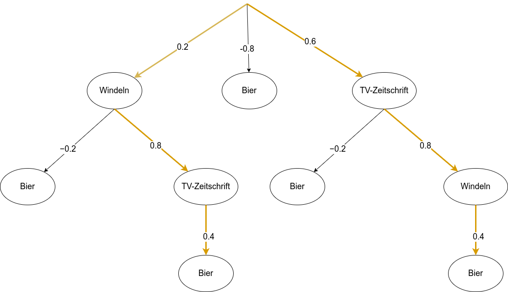

# Aufgabe 2

## 1
N = 5, n = 3, p_0 = 3 / 5

### A
Windeln  
n = 3, p(S) = 2 / 3  
S = (2/3 - 3/5) * 3 = 0.2  

Bier  
n = 3, p(S) = 1 / 3  
S = (1/3 - 3/5) * 3 = -0.8

TV-Zeitschrift  
n = 4, p(S) = 3 / 4  
S = (3/4 - 3/5) * 4 = 0.6  

Windeln, Bier
n = 2, p(S) = 1 / 2  
S = (1/2 - 3/5) * 2 = −0.2  

Windeln, TV-Zeitschrift  
n = 2, p(S) = 2 / 2  
S = (2/2 - 3/5) * 2 = 0.8  

Bier, TV-Zeitschrift
n = 2, p(S) =  1 / 2  
S = (1/2 - 3/5) * 2 = −0.2  

Windeln, Bier, TV-Zeitschrift
n = 1, p(S) = 1 / 1  
S = (1/1 - 3/5) * 1 = 0.4   

## B
Die beste Subgruppe wäre {Windeln, TV-Zeitschrift}

## C
{TV-Zeitschrift}

## D

# 2
  

# 3
Bei Subgruppen geht es nicht darum die Zielvariable zu klassifizieren, sondern darum der Zielvariable gewisse Gruppen zuzuordnen, die erfüllt sind, wenn die Zielvariable erfüllt ist.
Bei einer Klassifikationsregeln würde man eben so noch fordern, dass die Zielvariable nicht erfüllt ist, wenn die Precondition nicht erfüllt ist. Dies ist bei einer Subgruppe nicht gefordert.
Das bedeutet also, dass sich aus den Subgruppen zwar zu teilen Klassifikationsregeln ableiten lassen können, aber nicht müssen.